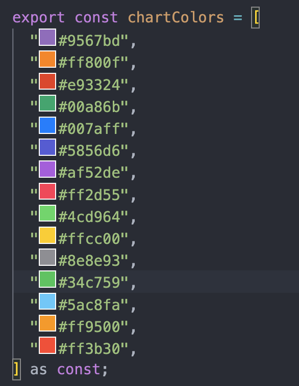

# shoCol

A VSCode extension that displays color preview boxes before hex color codes in your editor.



## Features

- Automatically detects hex color codes (e.g., `#9567bd`, `#ff800f`, `#abc`)
- Displays a small color preview box just before each hex code
- Updates in real-time as you edit your code
- Works with both 3-digit and 6-digit hex colors

## Usage

Simply open any file containing hex color codes, and you'll see color preview boxes appear before each hex code automatically.

## Development

1. Install dependencies:
   ```bash
   npm install
   ```

2. Compile the extension:
   ```bash
   npm run compile
   ```

3. Press `F5` in VSCode to open a new window with the extension loaded.

4. Make changes to the code in `src/extension.ts` and press `Ctrl+R` (or `Cmd+R` on Mac) in the extension development window to reload.

## License

MIT

